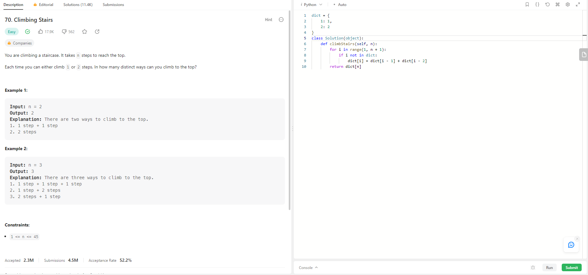
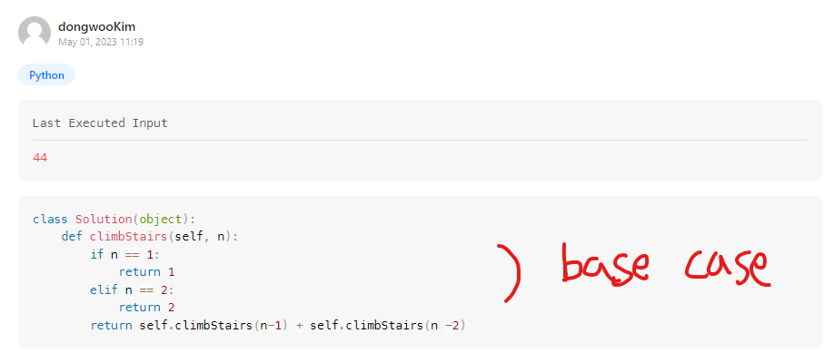
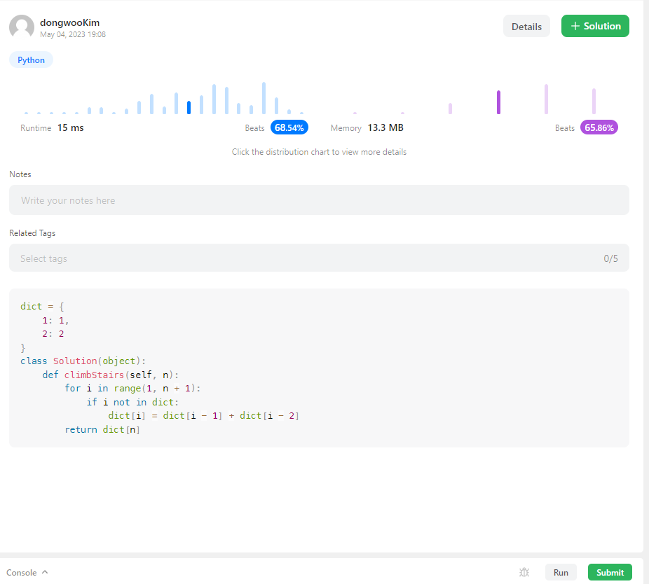

# Climbing Stairs - 알고리즘 문제(Leet Code)

-    

1. 문제 이해하기
2. 문제 접근하기
3. 문제 코드 작성하기
4. 실행하기   

## 1. 문제 이해하기

<section style="margin:40px 0">
  
  해당 문제는 계단이 주어지고 그 계단을 <strong>1 or 2 </strong>계단씩 갈수있을때 
  총 갈수있는 
  경우의 수를 묻는 문제이다.
</section>

## 2. 문제 접근하기 > 문제 코드 작성하기 > 실행하기  

- ## 재귀적으로 생각하기

  처음 문제를 볼때 가진 생각은 "어 이거 재귀적으로 풀면될것같다." 라고 들었다
  그래서 베이스 케이스, 점화식을 만들어서 했다..  
  
  결과는  , 즉 시간 초과가 되었다는것이다. 
  <strong>시간 복잡도를 O(n)</strong> 까지만 생각하고 재귀할때 메모리상에 여러번 호출할때는 생각을 못해서 이런일이  
  발생했다  

- ## DP로 생각하기

  그후 다른방법이 없을까 생각하고 DP를 배우게 되었다. 
  <strong>※ DP는 완전탐색을 큰 문제로 보고 큰 문제들을 하위문제(subproblem) 으로 나누어서 풀고 
  그후 하위 문제들각의 답을 각각 공통점을 더해서 큰 문제를 푼다</strong>

  - Top down
  - Bottom up
    두가지 방식이 있다고 한다 

    그래서 내가 한 재귀 방식, 즉 Top down 말고 이번에는 Bottom up을 생각해 보도록 해봤다

    <strong>dictionary</strong>를 사용해서 <strong>O(1)</strong>, 한번씩만 구하면 결국 <strong>O(n)</strong>을 사용하면 된다는거!!

    dict라는 <strong>dictionary</strong>를 만들고 해당 key, value는 1 ~ 2 계단을 리터럴로 넣어준다.
    그리고 <strong>dictionary</strong>의 key에 i가 없을때 만족하는 코드를 작성했다.
    
